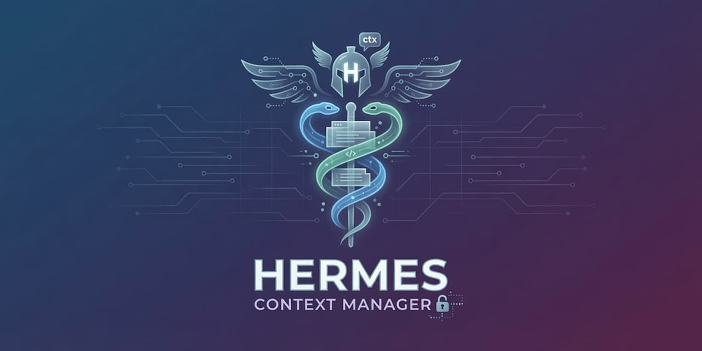
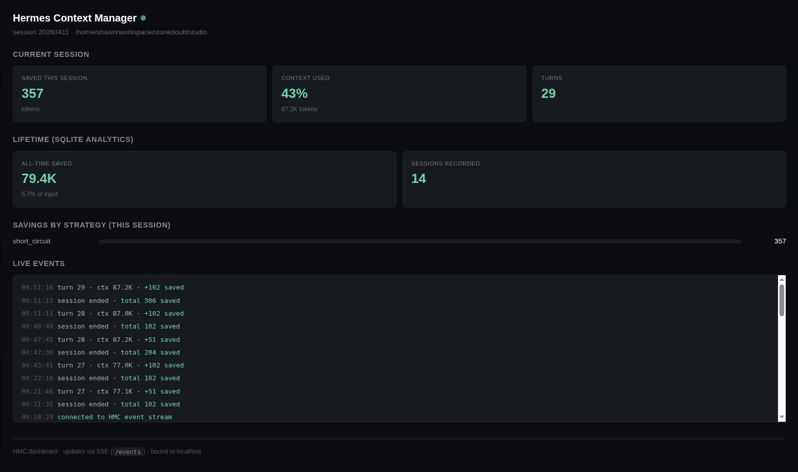

<p align="center">
  
</p>

# Hermes Context Manager

Hermes Context Manager (HMC) is a silent-first context optimization plugin for the [Hermes Agent](https://github.com/NousResearch/hermes-agent) gateway. It automatically compresses tool outputs, deduplicates repeated work, and summarizes completed phases so the main model sees a shorter, cleaner conversation without ever knowing compression happened.

HMC works **in tandem** with Hermes Agent's built-in `ContextCompressor` — it's a per-tool-call, per-turn silent compressor that layers on top of Hermes's own summarization pipeline, not a replacement for it. Both run.

Full attribution to the upstream projects HMC is adapted from is at the bottom of this README.

## Features

- **Silent-first compression** — the main model never sees compression happening. Pattern matching, deduplication, truncation, code-aware filtering, and error purging all run in the background with zero model involvement.
- **Two-tier compression pipeline** — single-message strategies (short-circuit, code filter, truncation) fire on every tool call as outputs arrive, so agent loops between user turns stay compressed continuously. Full-list strategies (dedup, error purging) fire on every user turn and at session end.
- **Code-aware compression** — strips function/class/struct bodies from tool outputs containing source code, preserving signatures, imports, and docstrings. Supports Python (indentation-aware), Rust, Go, JavaScript, TypeScript. String-aware brace counting that handles `"hello {world}"` correctly. JSX bailout for React safety.
- **Pattern-based short-circuits** — tool outputs matching known success shapes (JSON success, pytest/cargo results, git output) collapse to one-liners.
- **Deduplication** — tool calls with identical arguments or near-identical normalized content collapse to a single result. `write_file` and `patch` are always protected.
- **Head/tail truncation** — long tool outputs keep the first and last N lines with a gap marker.
- **Background compression** — when context crosses a configurable threshold, an auxiliary model (never the main model) summarizes completed work ranges and removes them from the conversation. Summaries land in a searchable per-session index.
- **Live web dashboard** — opt-in embedded HTTP+SSE server (stdlib only, localhost-bound). Streams turn, tool-call, and session-end events to a single-page dashboard. Shows current-session metrics, lifetime totals, per-strategy breakdown, a recent-sessions "workhorses" table, and a live event log. Launch via `/hmc dashboard action=start`.
- **Persistent analytics** — SQLite-backed cumulative token-savings store: per-session, per-day, per-month, per-project. Survives restarts. Queryable via `hmc_control analytics`.
- **`hmc_control` tool + `/hmc` slash command** — control surface exposing `status`, `context`, `stats`, `index`, `analytics`, `dashboard`, `sweep`, `manual_set`, and `manual_status` actions.
- **Manual mode and per-turn sweep controls** — override automatic compression when you need to.
- **Sidecar JSON persistence** under `$HERMES_HOME/hmc_state` for per-session state and phase indexes.

## Install

### From GitHub (recommended)

Install the latest `main` directly via the Hermes plugin manager. Any of
these forms works:

```bash
# Full HTTPS URL
hermes plugins install https://github.com/entrepeneur4lyf/hermes-context-manager
hermes gateway restart

# owner/repo shorthand (resolves to the https GitHub URL)
hermes plugins install entrepeneur4lyf/hermes-context-manager
hermes gateway restart

# SSH, if you have it configured
hermes plugins install git@github.com:entrepeneur4lyf/hermes-context-manager.git
hermes gateway restart
```

Under the hood `hermes plugins install` does a `git clone --depth 1` into
a temp directory, reads `plugin.yaml` for the canonical plugin name
(`hermes-context-manager`), and copies the source into your Hermes plugins
directory. Pinning a specific tag or branch at install time is not
currently supported — use the local-clone workflow below if you need that.

### From a local clone

Clone the repo and point the plugin manager at the checkout. Useful when
you want to edit the source, track a feature branch, or pin a specific
tag / commit:

```bash
git clone https://github.com/entrepeneur4lyf/hermes-context-manager.git
cd hermes-context-manager
git checkout v0.2.0          # optional — pin to a tag or branch
hermes plugins install "file://$(pwd)"
hermes gateway restart
```

The installer prints a warning for `file://` URLs ("insecure/local URL
scheme") — that is expected for local dev and safe to ignore here.

Pulling updates is just `git pull` (and `git checkout` again if you pinned
a ref) followed by `hermes gateway restart`.

### Switching between install methods

Hermes will **not** overwrite an existing install through a symlink.
If you installed once via `file://$(pwd)` (which creates a symlink at
`~/.hermes/plugins/hermes-context-manager` pointing at your repo) and
then try to switch to the GitHub URL form, you will hit:

```
Error: Invalid plugin name 'hermes-context-manager': resolves outside the plugins directory.
```

That is Hermes refusing to follow a symlink out of the plugins
directory — a safety check, not a bug. Remove the stale symlink and
retry:

```bash
rm ~/.hermes/plugins/hermes-context-manager
hermes plugins install https://github.com/entrepeneur4lyf/hermes-context-manager
hermes gateway restart
```

`rm` on a symlink removes only the link, not the repository it points
at.

### What the installer does

- Copies the bundled `hmc` skill into `~/.hermes/skills/hmc/SKILL.md` on first load.
- Copies `config.yaml.example` to `config.yaml` inside the installed plugin
  directory so the defaults are editable in place.

### Requirements

- Hermes Agent gateway
- Python 3.10+
- `PyYAML` (pulled in automatically; no other non-stdlib deps)

## Configuration

HMC reads `config.yaml` from the **installed plugin directory**. On first
load, the plugin copies `config.yaml.example` next to itself as
`config.yaml`, so the defaults are immediately editable in place. Edit
the file and restart the Hermes gateway to apply changes:

```bash
hermes gateway restart
```

If you cloned the repo and used the local-clone install workflow, the
file lives at `<repo>/config.yaml` and `git pull` will not overwrite it
(it's gitignored). For a GitHub-URL install, the file is inside whichever
plugin directory Hermes wrote to during install — `hermes plugins list`
will show you the path.

### Full configuration shape

Every key shown below is optional; missing keys fall back to the defaults
listed in this table.

```yaml
# config.yaml — all defaults shown

enabled: true              # master switch — set false to disable HMC entirely
debug: false               # extra debug logging

manual_mode:
  enabled: false           # if true, automatic strategies are gated by the
                           # next flag and the user drives compaction by hand
  automatic_strategies: true

compress:
  max_context_percent: 0.8 # background compression triggers when the
                           # previous turn's context usage crosses this
  min_context_percent: 0.4 # reserved for future "compress down to N%" target
  protected_tools:         # tool calls of these types are NEVER pruned
    - write_file
    - patch

strategies:
  deduplication:
    enabled: true
    protected_tools: []    # additional tool names to skip when deduping
                           # (write_file/patch are always protected)
  purge_errors:
    enabled: true
    turns: 4               # tool errors older than N turns are replaced
                           # with a one-line placeholder
    protected_tools: []

short_circuits:
  enabled: true            # pattern-replace known success outputs
                           # (JSON success, pytest results, git output…)

truncation:
  enabled: true
  max_lines: 50            # outputs longer than this get head/tail-truncated
  head_lines: 10           # lines kept from the top
  tail_lines: 10           # lines kept from the bottom
  min_content_length: 500  # minimum byte length before truncation kicks in

background_compression:
  enabled: true            # auxiliary-model summarization of stale ranges
  protect_recent_turns: 3  # never compress the last N user turns

analytics:
  enabled: true            # SQLite-backed cumulative savings store
  retention_days: 90       # on-write TTL — older rows pruned automatically
  db_path: ""              # empty == ~/.hermes/hmc_state/analytics.db
                           # honors HMC_DB_PATH env var override

code_filter:
  enabled: true            # strip function/class bodies in code outputs
  languages:               # which languages to filter
    - python
    - javascript
    - typescript
    - rust
    - go
  min_lines: 30            # don't filter snippets shorter than this
  preserve_docstrings: true  # keep Python triple-quotes / Rust /// / JSDoc
```

### Tuning notes

- **Aggressive compression** for long sessions: drop `compress.max_context_percent`
  to `0.6` and `background_compression.protect_recent_turns` to `2`.
- **Conservative mode** (mostly cosmetic cleanup, never summarize):
  set `background_compression.enabled: false` and rely on Layer 0
  strategies (truncation / dedup / short-circuits) only.
- **Audit-friendly mode** (no purging of errors): set
  `strategies.purge_errors.enabled: false` so failed tool calls remain
  in context indefinitely.
- **Per-tool protection**: add tool names to `compress.protected_tools`
  or `strategies.deduplication.protected_tools` to opt them out of
  pruning. `write_file` and `patch` are always protected regardless of
  config.
- **Fully manual**: set `manual_mode.enabled: true` and
  `manual_mode.automatic_strategies: false`, then drive compaction with
  the `hmc_control` `sweep` action.
- **Disable historical analytics**: set `analytics.enabled: false` if
  you don't want a SQLite file in `~/.hermes/hmc_state/analytics.db`.
  Runtime stats (`hmc_control stats`) still work — only the cumulative
  cross-session view goes away.
- **Long-term analytics retention**: bump `analytics.retention_days`
  past the 90-day default if you want longer history. SQLite size grows
  roughly linearly (~one row per session per active strategy).
- **Aggressive code filtering**: drop `code_filter.min_lines` to `10`
  to filter even short snippets. Set
  `code_filter.preserve_docstrings: false` to elide docstrings too
  (saves more bytes at the cost of model context for what each
  function does).
- **Disable code filtering for one language**: remove it from
  `code_filter.languages`. Useful if a particular language's filter
  output isn't useful in your workflow.

## How the plugin operates

HMC is a **silent-first** context manager. It hooks into Hermes's request
lifecycle and rewrites the conversation the model is about to see. The main
model only ever sees a shorter, cleaner conversation plus a one-liner system
hint; all the compression work happens in the background.

### Hooks

On `register(ctx)` the plugin installs four hooks plus the `hmc_control` tool:

| Hook               | What HMC does                                                                                                           |
| ------------------ | ----------------------------------------------------------------------------------------------------------------------- |
| `pre_tool_call`    | Records the tool name, fingerprints the input args, maps `task_id` → session.                                            |
| `post_tool_call`   | Finalizes the `ToolRecord`, compresses the new tool output in place (short-circuit, code filter, truncation), and publishes a live `tool` event to the dashboard. |
| `pre_llm_call`     | Restores the previous turn's mutations, runs the full compression pipeline (all single-message strategies plus dedup and error purging), triggers background compression if the context threshold is hit, and publishes a `turn` event. |
| `on_session_end`   | Runs a final compression pass to catch any tail-end tool outputs, persists final state, writes an analytics row, publishes a `session_end` event, and restores the raw conversation so Hermes saves the unmutated session file. |

All hooks run under an `RLock` and are wrapped in broad `try/except` so a
plugin bug can never crash Hermes itself — failures are logged and the
request proceeds untouched.

### Compression strategies

HMC runs six strategies in a layered pipeline. Single-message strategies fire
both on `post_tool_call` (for immediate compression of new tool outputs) and
on `pre_llm_call` (as a safety net). Full-list strategies require the whole
conversation and fire on `pre_llm_call` and `on_session_end`.

**Layer 0 — Silent strategies** (`engine.py`). No model involvement.

1. **Short-circuit replacement** (`short_circuits.py`) — if a tool output
   matches a known success pattern (`{"status":"ok"...}`, `=== N passed ===`,
   `already up to date`, etc.) the entire body is replaced with a one-liner
   like `[tests: 42 passed]`. Errors are protected by a global regex safety
   net and are never short-circuited.
2. **Code-aware compression** (`code_filter.py`) — for tool outputs that
   contain source code, strips function/class/struct bodies while preserving
   signatures, imports, and (optionally) docstrings. Two-pass pipeline:
   comment stripping (preserves doc comments via `///`, `/** */`, Python
   triple-quotes) then body elision. Indentation-aware Python path;
   string-aware brace counting for Rust/Go/JS/TS so `"hello {world}"` and
   template literals don't corrupt depth tracking; JSX/TSX bailout when
   React components are detected. Triggered by fenced markdown blocks or
   tool-arg file extensions (`.py`, `.ts`, `.tsx`, `.js`, `.jsx`, `.rs`, `.go`).
3. **Head/tail truncation** (`truncation.py`) — long tool outputs keep the
   first N and last M lines with a `… N lines omitted …` marker. Configurable
   via `truncation.max_lines / head_lines / tail_lines`. Errors are left intact.
4. **Deduplication** — tool calls are fingerprinted as `tool_name::sorted_args`.
   Repeated reads of the same file, identical `git status` calls, etc. are
   collapsed to `[Output removed — tool called 5× with same args, showing last
   result only]`. A second pass hashes normalized content (timestamps, UUIDs,
   and hex hashes replaced with placeholders) so near-identical outputs also
   collapse. `write_file` and `patch` are always protected.
5. **Error purging** — tool errors older than N turns are replaced with
   `[Error output removed — tool failed more than N turns ago]`. Configurable
   via `strategies.purge_errors.turns`.

**Layer 1 — Background compression** (`background_compressor.py`)

Triggers when `last_context_percent ≥ compress.max_context_percent`
(default `0.80`). Runs inside `pre_llm_call` but **without the session lock**
held, so the auxiliary LLM call can take several seconds without blocking
concurrent tool-call hooks.

1. `identify_stale_ranges` finds contiguous blocks of completed work,
   protecting the most recent `protect_recent_turns` user turns.
2. The plugin calls `agent.auxiliary_client.call_llm(task="compression", …)`
   with a compact transcript of the stale range. This is the **auxiliary**
   model, not the main model — the user-facing conversation never sees it.
3. A structured entry is appended to
   `~/.hermes/hmc_state/{session}_index.jsonl`:
   `{turn_range, topic, summary, timestamp, message_count}`.
4. The compressed range is deleted from the conversation list. The
   per-session index is queryable outside the model via
   `hmc_control action=index` for debugging and operator visibility.

**Layer 2 — Passive context** (`prompts.py`)

`pre_llm_call` returns a tiny system-context injection that tells the
model "context management is handled automatically, you do not need to
manage it yourself". When the session has indexed completed phases,
the injection also lists their turn ranges and topics. That is the
only signal the main model ever gets about HMC's presence.

### Per-turn data flow

```
pre_tool_call ──▶ record input fingerprint in SessionState
                      │
post_tool_call ─▶ finalize ToolRecord (error flag, tokens, timestamp)
                   run single-message strategies on the new tool output
                     (short_circuit → code_filter → truncation) in place
                   update context stats
                   publish "tool" event to the dashboard
                      │
pre_llm_call ───▶ (locked)   restore previous turn's mutations
                             prepare background compress args (if any)
                 (unlocked)  run auxiliary LLM summarization (if triggered)
                 (locked)    finish compress: index entry + delete range
                             run full materialize_view: all six strategies,
                               lazy content_backup capture, snapshot to ring
                             persist state
                             publish "turn" event to the dashboard
                             return {"context": "..."} system hint
                      │
on_session_end ─▶ restore previous turn's mutations
                   run final materialize_view over the raw conversation
                     (catches tail-end tool outputs that never saw a
                      pre_llm_call sweep)
                   restore again so Hermes saves the unmutated session file
                   persist final state, write analytics row, publish
                     "session_end" event, drop session memory
```

### In-place mutation and restore

Hermes passes `pre_llm_call` a shallow copy (`list(messages)`) of its real
conversation list. Replacing that copy has no effect — it does not propagate
back. But the dicts inside the copy are the **same dicts** Hermes holds, so
mutating `message["content"]` in place flows through to the API request.

HMC exploits this: the strategy pipeline edits `content` directly on those
shared dicts, while `materialize_view` returns a `content_backup: dict[int, Any]`
that captures each message's original content by list-index. On
`on_session_end` (or the next `pre_llm_call`) `_restore_mutations` writes the
backup values back, leaving Hermes's conversation byte-identical to what the
user would have seen without the plugin.

### State and persistence

- **`SessionState`** — per-session runtime tracking tool calls, pruned IDs,
  token savings (both a real-bytes accumulator and a per-tool-call-per-strategy
  diagnostic counter), turn counter, context stats, and a 50-entry ring buffer
  of per-turn snapshots for the dashboard.
- **`JsonStateStore`** (`persistence.py`) — atomic writes via
  `NamedTemporaryFile` + `os.replace` to `~/.hermes/hmc_state/{session}.json`.
  Temp-file cleanup on exception so failed writes don't leak.
- **Session index** — append-only JSONL at
  `~/.hermes/hmc_state/{session}_index.jsonl`, one record per compressed range.
- **Analytics database** — SQLite at `~/.hermes/hmc_state/analytics.db` in WAL
  mode with a 90-day on-write retention TTL. One row per `(session, strategy)`
  is written on `on_session_end`.
- All mutating code paths hold a reentrant lock so concurrent hooks see
  consistent state — no TOCTOU windows around the "is this tool_call_id new?"
  check.

### Live dashboard (opt-in)

<p align="center">
  
</p>

HMC includes an embedded web dashboard for watching token savings roll
in as the model works. It's **opt-in** (dormant until you start it)
and **stdlib only** (no Flask, no FastAPI, no external CDN). Launch it
via the `hmc_control` tool:

```
/hmc dashboard action=start
→ {"running": true, "url": "http://127.0.0.1:48800/", ...}
```

The dashboard binds to a base port of `48800` and rotates upward if
that port is busy, so the URL stays bookmarkable on clean systems but
tolerates local contention.

Open the URL in your browser. The page shows:

- **Current session metrics** — saved this session, context usage %,
  turns completed
- **Lifetime totals** — all-time saved, sessions recorded, % of input
  compressed (from the SQLite analytics layer)
- **Savings by strategy** — per-strategy bars for the current session
- **Recent sessions (workhorses)** — a table of recent sessions sorted
  by most recent activity, with short ID, time, context %, tool count,
  total saved, and the per-strategy breakdown for each. The live
  session is tinted and the active session gets a filled dot prefix.
  Useful for spotting which sub-agent sessions are doing the heavy
  lifting on agent-driven workloads.
- **Live event stream** — `turn`, `tool`, and `session_end` events
  pushed via Server-Sent Events (SSE) with per-event delta savings
  and running totals

The page auto-refreshes every 10 seconds as a safety net, but the
primary update path is SSE: the plugin publishes events directly into
an in-process bus from `post_tool_call`, `pre_llm_call`, and
`on_session_end`, and the browser's `EventSource` connection receives
them immediately. Tool-level heartbeats from `post_tool_call` keep the
event log active even during long agent loops between user turns.

**Security:** the server binds to `127.0.0.1` only and has no auth
layer. This is explicitly NOT designed for remote exposure. If you
want to access it over a network, put a real reverse proxy in front.

Stop the dashboard with `/hmc dashboard action=stop`, or let Hermes
shut it down automatically on exit (the server thread is a daemon).

### Control surface

The `hmc_control` tool (and the bundled `/hmc` slash command) exposes:

| Action          | Description                                                             |
| --------------- | ----------------------------------------------------------------------- |
| `status`        | Compact one-screen overview: mode, context %, tokens saved, breakdown.  |
| `context`       | Detailed context-window stats (tokens, window, percent, counts).        |
| `stats`         | Token savings totals by strategy.                                       |
| `index`         | Lists all indexed completed-work entries for this session.              |
| `analytics`     | Cumulative savings from the SQLite store. Supports `scope=global\|project`, `period=all\|day\|month\|recent\|project`, and `limit`. |
| `dashboard`     | Live web dashboard lifecycle. `sub_action=start` launches a localhost HTTP+SSE server and returns the URL; `stop` shuts it down; `status` (default) reports whether it's running. |
| `sweep`         | Manually prune tool outputs (optional `count`, respects protected list).|
| `manual_set`    | Toggle manual mode (`enabled: bool`). In manual mode automatic strategies are gated by `manual_mode.automatic_strategies`. |
| `manual_status` | Report whether the plugin is currently in manual mode.                  |

## Test

```bash
python -m unittest discover -s tests -v
```

## Attribution

### Pi Dynamic Context Pruning

The silent-first architecture (in-place mutation pipeline, message-ID
injection, per-turn restore) is adapted from Pi Dynamic Context
Pruning for Hermes's plugin and skill model:
[complexthings/pi-dynamic-context-pruning](https://github.com/complexthings/pi-dynamic-context-pruning)

### RTK — Rust Token Killer

A substantial portion of the Layer-0 strategy pipeline is a direct
port of patterns from [RTK (Rust Token Killer)](https://github.com/rtk-ai/rtk),
the CLI proxy that reduces LLM token consumption by 60–90% on
developer commands. Specifically:

- **Short-circuit pattern matching** — ported from RTK's
  `match_output` stage in `src/filters/*.toml` and `src/core/filter.rs`
- **Head/tail truncation** — ported from RTK's `head_lines` / `tail_lines`
  pipeline step
- **Normalized content deduplication** — ported from RTK's
  normalization layer for replacing timestamps/UUIDs/hex hashes
- **Asymmetric compression** (skip errors) — ported from RTK's
  success-first pruning convention
- **Savings tracking by strategy type** — conceptually aligned with
  RTK's `CommandRecord` / `GainSummary` / `gain.rs` module
- **SQLite analytics layer** (`analytics.py`) — ported from RTK's
  `src/core/tracking.rs`, including the schema shape, WAL pragma,
  on-write 90-day retention, and the `project_path` GLOB-filter query
  pattern
- **Code-aware compression** (`code_filter.py`) — ported from RTK's
  `AggressiveFilter` in `src/core/filter.rs`, with two material
  improvements: a string-aware brace counter (RTK's naive
  `count('{')` corrupts on string literals containing braces) and a
  from-scratch indentation-aware Python path (RTK has no real Python
  support — its brace-based algorithm accidentally collapses Python
  functions to just their signatures)

Where HMC's implementation diverges from RTK, the divergence is
noted in the relevant module docstrings. Go check out RTK — the Rust
implementation is genuinely impressive and the ideas are theirs.
